### Total_Counts Histogram before filtering
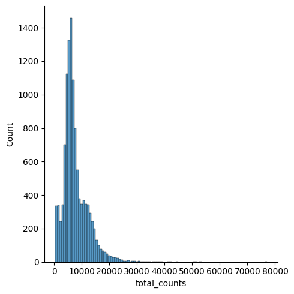

### Pct_MT Violin before filtering
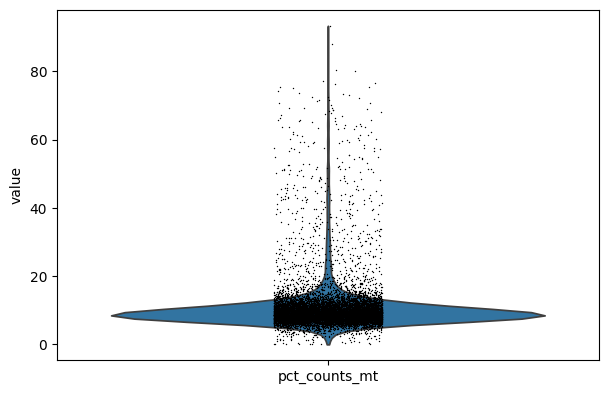

### N_genes x Total_Counts Scatterplot before filtering
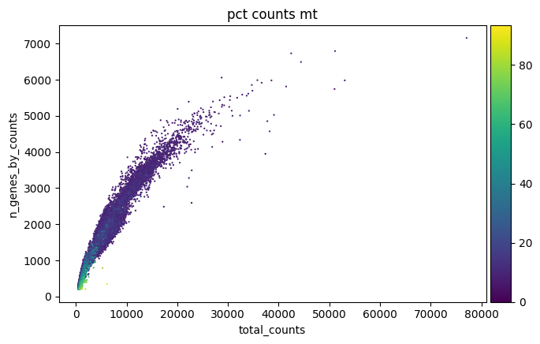

### Total_Counts Histogram after filtering
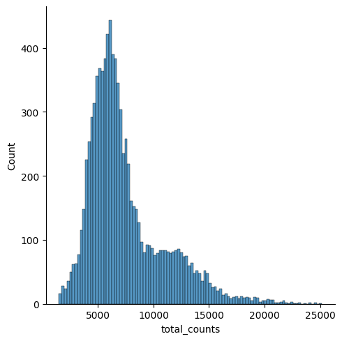

### Pct_MT Violin after filtering
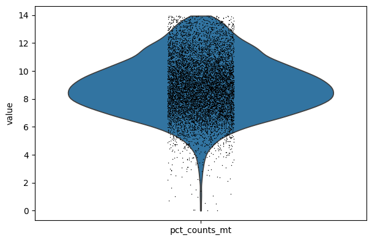

### N_genes x Total_Counts Scatterplot after filtering
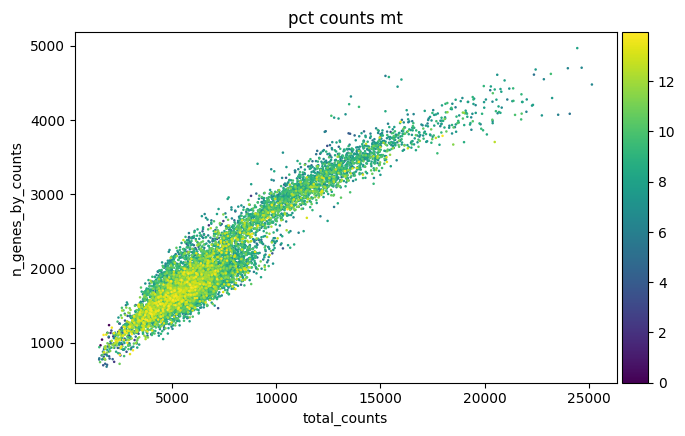

### Celltypist High Res Umap
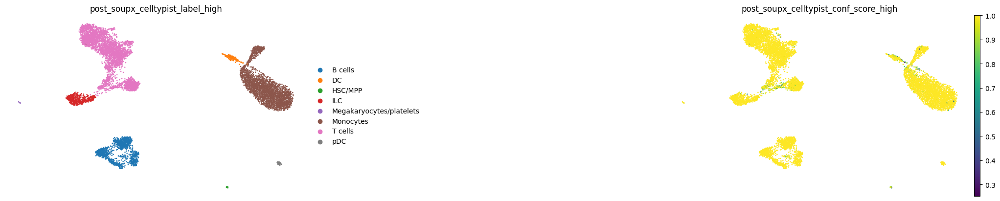

### Celltypist Low Res Umap
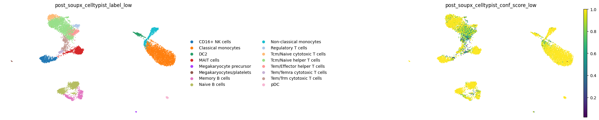

### Final Celltypist Umap: Low Res with Labels
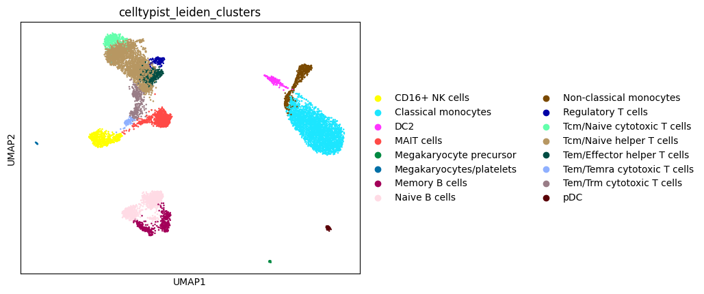

### Leiden Umap for Manual Annotation with Res for 0.25, 0.5, and 1
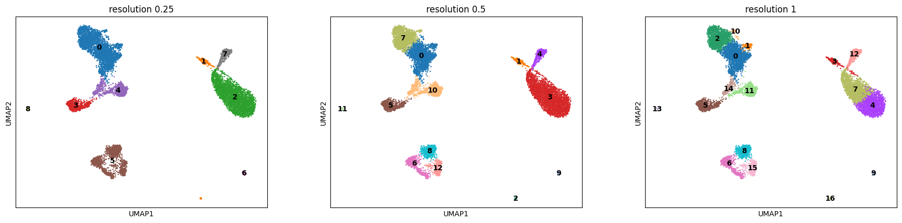

### Cluster 7 Subcluster
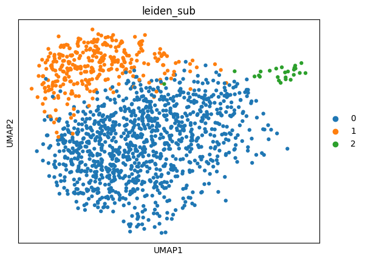

### Leiden Res 0.5 with Cluster 7 Subcluster
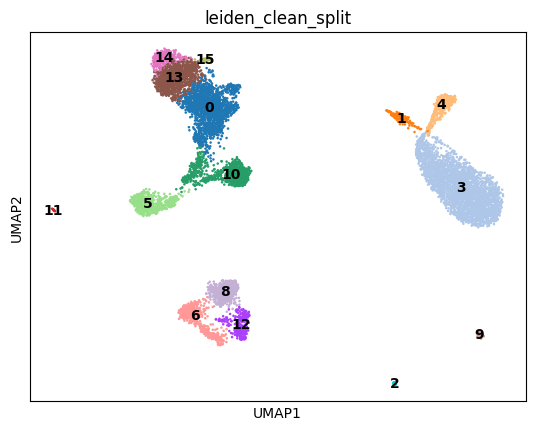

### Rank Genes Dotplot
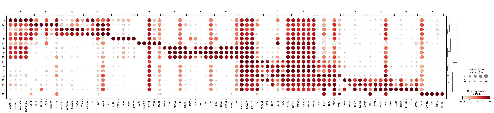

### Filtered Rank Genes Dotplot
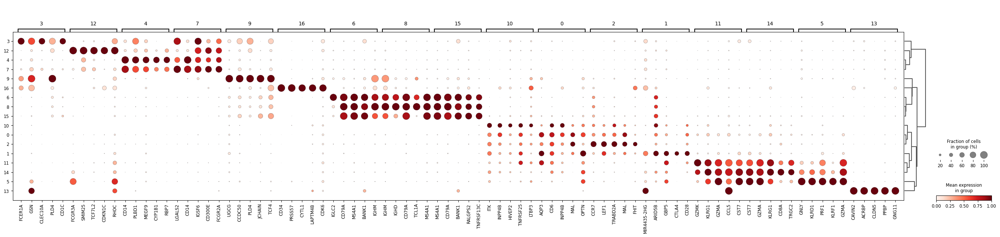

### Final Manually Annotated Umap with Cluster Labels
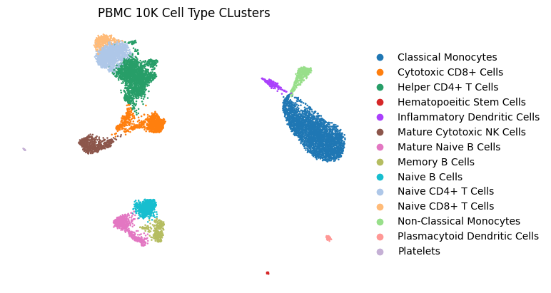
